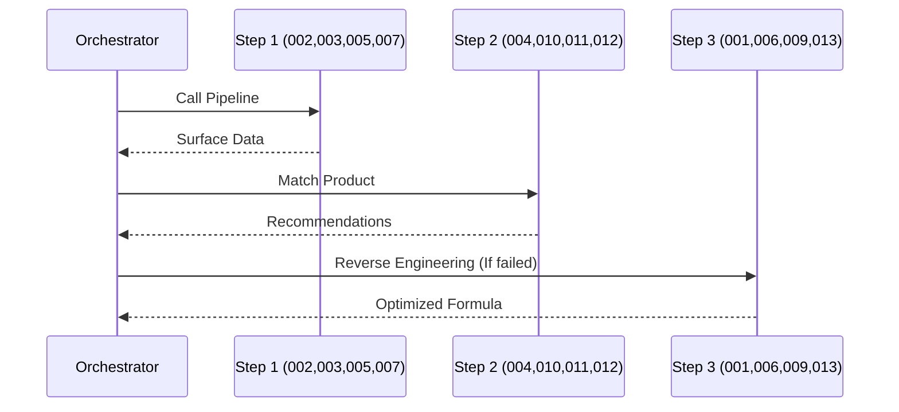

# 중앙 오케스트레이터 (SG_proj_014)

## 1. 개요
Step 1, 2, 3를 연결하여 SG 플랫폼의 전체 추론 흐름을 제어하는 마스터 라우터입니다.

## 2. 시스템 아키텍처

```mermaid
sequenceDiagram
    participant O as Orchestrator
    participant M1 as Step 1 (002,003,005,007)
    participant M2 as Step 2 (004,010,011,012)
    participant M3 as Step 3 (001,006,009,013)

    O->>M1: Call Pipeline
    M1-->>O: Surface Data
    O->>M2: Match Product
    M2-->>O: Recommendations
    O->>M3: Reverse Engineering (If failed)
    M3-->>O: Optimized Formula
```

## 3. 기술 스택
- Backend: FastAPI, Pydantic

## 4. 참조 문서
- ADR-0001
