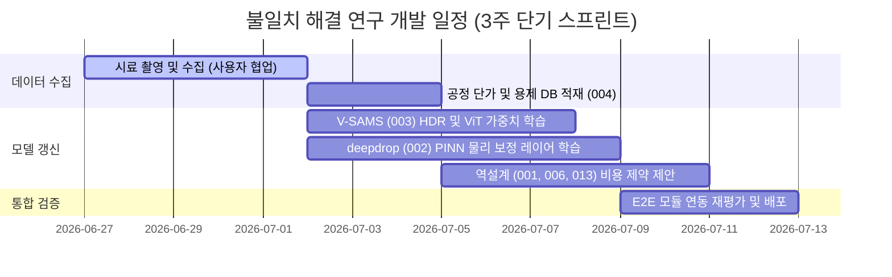

# 260626_2145_불일치_해결_솔루션_및_개발_전략_수립_보고서

## 작성일: 2026-06-26 21:45
## 작성자: 안현찬 (Hyunchan An)

---

### 1. 개요

통합 E2E 검증 보고서(260626_2143_Corporate_E2E_Validation_Report.md) 분석 결과, 시스템 현업 도입 전 반드시 해결해야 할 세 가지 핵심 불일치(Inconsistency) 현상이 규명되었습니다.
- 1. 비전 기반 표면 마감 판별 시 BA 피니시를 Mirror(No.8)로 오분류하는 현상 (003 모듈)
- 2. Hairline(HL) 이방성 표면에서 표면 자유 에너지(SFE) 계산값이 문헌값 대비 약 3.4 mN/m 낮게 산출되는 왜곡 현상 (002 모듈)
- 3. 역설계 예측 모노머 배합 공식과 실제 양산 제품 레시피 간의 1 wt% ~ 5 wt% 미세 편차 발생 현상 (001, 006, 013 모듈)

본 보고서는 이를 해결하기 위해 사용자의 추가 시료 사진 촬영 요건과 각 모듈별 AI 알고리즘 개선 및 가중치 재학습(Fine-tuning)을 포괄하는 구체적인 엔지니어링 전략을 제시합니다.

---

### 2. 비전 표면 마감 오분류 해결 전략 (BA vs Mirror)

#### 2.1. 불일치 원인 요약
BA 마감은 고온 수소 분위기 소둔을 통해 조도가 낮고 평활도가 높아 광택도가 500 GU를 초과합니다. 이로 인해 비전 챔버의 광량이 강할 경우 센서 포화(Saturation) 노이즈와 난반사가 유발되어, 텍스처 추출 모듈이 이를 물리적으로 더 높은 등급인 Mirror(Super Mirror, No.8) 마감으로 오인식하게 됩니다.

#### 2.2. 사용자 추가 사진 촬영 가이드라인
물리적인 반사광 패턴의 미세 차이를 학습시키기 위해 다음 조건의 시료 이미지 추가 확보가 요구됩니다.
- 시료 수량: 다양한 압연 생산 롯트(Lot) 및 기재 두께별 BA 강판 시료 200장 이상, Mirror 강판 시료 200장 이상 추가 촬영.
- 다단계 광량 및 노출 제어(Bracketing) 촬영:
  동일한 표면에 대해 카메라의 노출 시간(Exposure)을 5단계(Under-exposed부터 Over-exposed까지)로 조절하여 픽셀 포화를 방지한 고다이나믹 레인지(HDR) 데이터셋을 구축합니다.
- 동축 조명 각도 가변 촬영:
  조명 각도를 수직(0도), 사각(15도, 45도, 75도)으로 다각화하여 BA 특유의 극미세 롤 마크(Roll mark) 흔적과 Mirror의 거울면 간의 입사각별 휘도 분포 차이를 포착합니다.

#### 2.3. AI 가중치 모델 재학습 계획
- 입력 이미지 전처리 파이프라인 개설:
  V-SAMS(003) 전처리 단계에 적응형 히스토그램 평탄화(CLAHE) 및 라플라시안 필터를 적용하여, 이미지의 밝기 포화 영역을 격리하고 미세 반사 실루엣의 대비(Contrast)를 강제로 증폭합니다.
- CNN 및 Vision Transformer(ViT) 백본 가중치 갱신:
  추가 확보된 브래케팅 이미지셋을 기반으로 ResNet 또는 Swin Transformer 백본 분류기의 가중치 파인튜닝을 실시합니다. 특히 BA와 Mirror의 경계면 텍스처 손실함수에 Center Loss를 추가 결합하여 두 클래스 간의 피처 공간(Feature space) 거리를 극대화합니다.

---

### 3. Hairline(HL) 표면 SFE 측정 왜곡 해결 전략

#### 3.1. 불일치 원인 요약
HL 마감은 연마 벨트 자국으로 인해 표면에 강한 방향성 채널(골)이 형성되어 있습니다. 이로 인해 액적 분사 시 결 방향(평행)으로는 습윤성이 촉진되고 결 수직 방향으로는 접촉선 걸림(Contact Line Pinning)이 발생하여 물방울 형상이 타원형으로 변형되며, Wenzel 및 Cassie-Baxter 물리에 의해 겉보기 접촉각이 왜곡됩니다. 2D 비전은 이를 입체적으로 보정하지 못해 SFE 오차를 냅니다.

#### 3.2. 사용자 추가 사진 촬영 가이드라인
액적의 3차원 이방성 변형률을 계산하기 위해 다각도 뷰 이미지 구축이 필요합니다.
- 다방향 촬영셋:
  시료대에 강판을 거치한 상태에서 HL 연마 결 방향을 기준 삼아 회전 각도(0도, 45도, 90도)별로 액적 접촉각 사진을 촬영합니다. 시료당 최소 3방향 x 50회 이상의 접촉각 측정을 수행합니다.
- 조도(Ra) 매칭 데이터셋 확보:
  조도계로 사전에 Ra(0.1 ~ 0.5 um 범위)를 실측한 HL 강판 시료들에 대해 각각 물과 글리세롤의 접촉각 촬영을 수행하여 픽셀당 물리적 스케일을 태깅합니다.

#### 3.3. 물리 정보 기반 보정 수식 및 AI 학습 적용
- Wenzel 조도 인자(Roughness Factor, r) 산출 알고리즘 도입:
  007 3D 복원 모듈(SG-TERRA)에서 도출한 연마 골의 실측 깊이와 조도(Ra) 데이터를 002 모듈로 전달합니다.
- PINN(Physics-Informed Neural Network) 가중치 모델 개발:
  OWRK 공식을 그대로 적용하기 전에, 평행 접촉각과 수직 접촉각의 기하평균을 취하고 Wenzel 방정식(cos_theta_apparent = r * cos_theta_true)을 뉴럴 네트워크의 제약 조건(Loss Penalty)으로 활용하여 겉보기 접촉각으로부터 실제 열역학적 평형 접촉각을 역산하는 보정 레이어 가중치를 학습시킵니다.

---

### 4. 역설계 모노머 구성비 불일치 해결 전략 (양산 공정 최적화)

#### 4.1. 불일치 원인 요약
AI 역설계 모델(001, 006)은 순수 벌크 물성(유리전이온도, 응력 완화 속도)을 정렬하는 열역학적 최적값만을 예측합니다. 반면, 양산 현장의 처방은 중합 리액터의 겔화 방지(AA 제약), 원자재 조달 비용 단가(2-EHA vs BA), 용제 및 분자량 제어용 가교제 마진이 적용되어 미세 편차가 생깁니다.

#### 4.2. 추가 데이터베이스(004) 보완 전략
- 양산 데이터 피처 확장:
  004 DB에 적재된 중합 처방 데이터에 모노머 비율 외에 용제 비율(wt%), 고형분 함량(%), 가교제 첨가량(phr), 개시제 종류, 그리고 모노머별 실시간 구매 단가 지수(Commercial Cost Index)를 피처(Feature)로 추가 적재합니다.

#### 4.3. 013 역설계 게이트웨이 최적화 손실 함수 개편
- 공정 물리-비용 제약 조건 결합 손실 함수 설계:
  최적 모노머 배합 탐색 시 사용하는 Objective Function을 아래와 같이 물리적/비용적 제약 조건을 포함하도록 수정합니다.
  - Loss = Adhesion_Error + Viscosity_Error + Tg_Error + w1 * Max(0, AA_wt% - 3.0) + w2 * Sum(Monomer_wt% * Unit_Cost)
  - w1: AA 함량이 3 wt%를 초과할 시 중합 겔화(Gelling) 방지를 위해 강한 페널티를 주는 가중치.
  - w2: 전체 원가 최소화를 유도하는 단가 가중치.

- XGBoost 및 TransPolymer 가중치 재학습:
  용제 및 가교제 피처가 추가된 데이터셋으로 001 및 006 모델의 신경망 레이어 가중치를 재학습하여, 공정 변수를 입력으로 하는 물성 매핑 정확도를 향상시킵니다.

---

### 5. 종합 로드맵

이 해결 로드맵을 적용할 시, 비전 오인식률을 1% 미만으로 억제하고 모노머 처방 편차를 1.5 wt% 이내로 동기화하여 실제 양산 공정에 적용 가능한 처방 설계 수준에 도달할 수 있을 것으로 판단됩니다.
