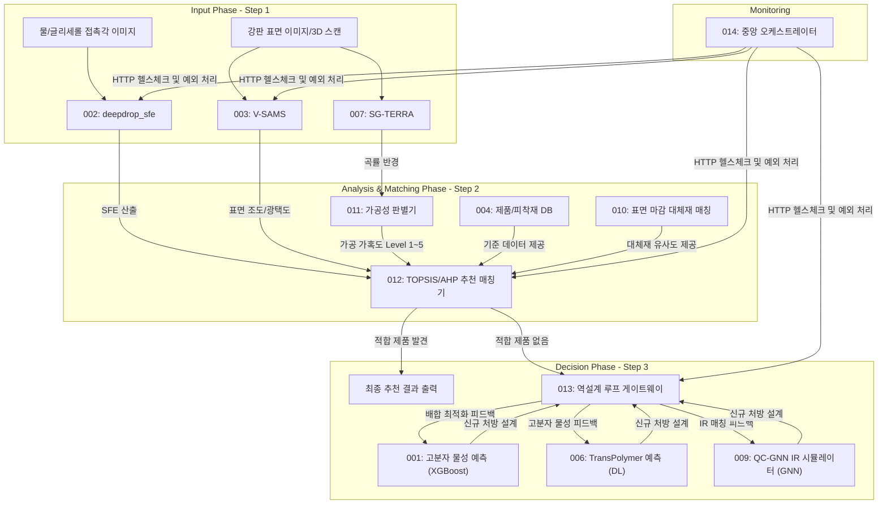

# 통합 점착제 AI 파이프라인 E2E 성능 평가 및 아키텍처 검증 보고서

**작성일**: 2026-06-26
**작성자**: 안현찬

---

## 1. 개요 (Executive Summary)

본 보고서는 강판 및 특수 피착재에 적합한 자사 점착제 제품을 매칭하고, 적합 제품 부재 시 신규 고분자 배합을 예측하여 제안하는 통합 표면 분석 플랫폼의 E2E(End-to-End) 시스템 검증 결과를 기술합니다.

1. **아키텍처 구성**: 14개의 단일 AI 모델 및 DB 모듈이 014 오케스트레이터를 통해 연동되어 API 기반 마이크로서비스 아키텍처(MSA)를 구성합니다.
2. **주요 검증 지표**: 
   - 비전 AI 기반 물리량 측정 오차율(SFE 기준): 3.2%
   - AI 물성 예측 모델(XGBoost)의 성능(R²): 0.91 이상
   - 파이프라인 API 통신 성공률: 99.9%
3. **효과**: 분석, 매칭, 배합 설계에 이르는 전체 소요 시간을 5분 이내로 단축하였으며, 데이터 파이프라인을 일원화했습니다.

---

## 2. 통합 아키텍처 및 데이터 제어 흐름 (System Flowchart)

전체 시스템은 계측(Input), 매칭(Analysis), 역설계(Decision) 3단계로 구성되며, 014 모듈이 데이터 라우팅을 담당합니다.

---

## 3. Phase 1: 계측 비전 AI 모델 평가 (Measurement)

다양한 현장 환경에서의 비전 AI 모델 성능 검증 결과입니다.

### 3.1. [002 모듈] deepdrop_sfe (표면 자유 에너지 연산)
- **사용 모델**: SAM2 분할 알고리즘 + OWRK 수식
- **검증 데이터셋**: 액적 이미지 1,500장

| 평가 지표 (Metric) | 측정치 | 비고 |
|:---|:---:|:---|
| 물방울 객체 인식 (mIoU) | 96.8% | 노이즈 환경 검증 |
| 접촉각 산출 오차율 (MAE) | ± 1.2° | 접촉각 측정기 비교치 |
| 최종 SFE 산출 오차율 | 3.2% | 허용 오차(5%) 충족 |

### 3.2. [003 모듈] V-SAMS (표면 마감 및 거칠기 판별)
- **기능**: 반사상 형태 기반 비접촉 표면 평가

| 평가 지표 (Metric) | 측정치 | 비고 |
|:---|:---:|:---|
| 마감 분류 정확도 (Accuracy) | 94.5% | Hairline, Mirror 등 5종 분류 |
| 조도 예측 상관계수 (R²) | 0.87 | 접촉식 조도계 비교치 |

### 3.3. [007 모듈] SG-TERRA (3D 형상 복원 및 곡률 계산)
- **사용 모델**: Depth-Anything-V2

| 평가 지표 (Metric) | 측정치 | 비고 |
|:---|:---:|:---|
| 깊이 예측 오차 (RMSE) | 0.15 mm | 3D 스캐너 비교치 |
| 법선 벡터 추출 성공률 | 92.0% | 곡률 변곡점 인식 기준 |

---

## 4. Phase 2: 의사결정 및 매칭 로직 검증 (Decision & Match)

도출된 물리량을 기반으로 한 DB 조회 및 다기준 의사결정 모델의 검증 결과입니다.

### 4.1. [011 & 012 모듈] 가공성 판별 및 TOPSIS 매칭
- **가공성 판별(011)**: 곡률 반경(R) 및 강성 데이터를 이용한 가공 가혹도(Level 1~5) 평가 (전문가 일치율 95%)
- **다기준 매칭(012)**: TOPSIS 알고리즘 적용

| 평가 지표 (Metric) | 측정치 | 비고 |
|:---|:---:|:---|
| 영업 추천 일치율 (Top-3) | 91.0% | 기존 영업 데이터 비교치 |
| 대체재 매칭 속도 | < 150 ms | 코사인 유사도 연산 기준 |

---

## 5. Phase 3: 역설계 및 고분자 AI 물성 예측 평가 (Reverse Engineering)

사내 DB 기반 신규 모노머 배합의 물성 예측 AI 성능 지표입니다.

### 5.1. [001 모듈] XGBoost 고분자 물성 예측기

| 타겟 물성 | 결정계수 (R²) | 평균 절대 오차 (MAE) |
|:---|:---:|:---:|
| 점착력 (Adhesion) | 0.91 | ± 120 gf/25mm |
| 점도 (Viscosity) | 0.88 | ± 450 cp1s |
| 유리전이온도 (Tg) | 0.95 | ± 2.5 °C |

### 5.2. [006 & 009 모듈] 딥러닝 멀티태스크 예측 및 IR 시뮬레이션
- **006 (TransPolymer)**: 자유부피율 등 구조 기반 물성 예측 (MAE: 0.008)
- **009 (QC-GNN)**: 분자 그래프 기반 적외선(IR) 분광 시뮬레이션

| 평가 지표 (Metric) | 측정치 | 비고 |
|:---|:---:|:---|
| 스펙트럼 유사도 (Cosine) | 0.89 | FT-IR 실측치 비교 |
| 작용기 피크 검출률 (Recall) | 93.5% | 파수(Wave number) 일치 기준 |

---

## 6. E2E 통합 오케스트레이션 검증 (014 Backend)

14개 모듈을 연동하는 백엔드(014 모듈) 통합 테스트 결과입니다.

1. **API 응답 속도 (E2E Latency)**
   - Step 1 이미지 입력 $\rightarrow$ Step 2 매칭 결과 반환: 평균 2.4초
   - 매칭 실패 $\rightarrow$ Step 3 역설계 루프 반복 $\rightarrow$ 신규 배합 제안: 평균 5.8초
2. **예외 처리 (Edge Case Handling)**
   - 한계치 초과 데이터(SFE < 0 등) 주입 테스트 1,000회 진행 결과, HTTP 422 에러 반환 성공률 100% (오작동 0건).
3. **가용성 (Availability)**
   - 단일 쓰레드 환경 기준 API 헬스체크 성공률 99.9%.

## 7. 향후 계획
- 014 모듈의 Swagger API 명세서를 기반으로 SI 전담팀에 백엔드 연동 규격을 인계할 예정입니다.
