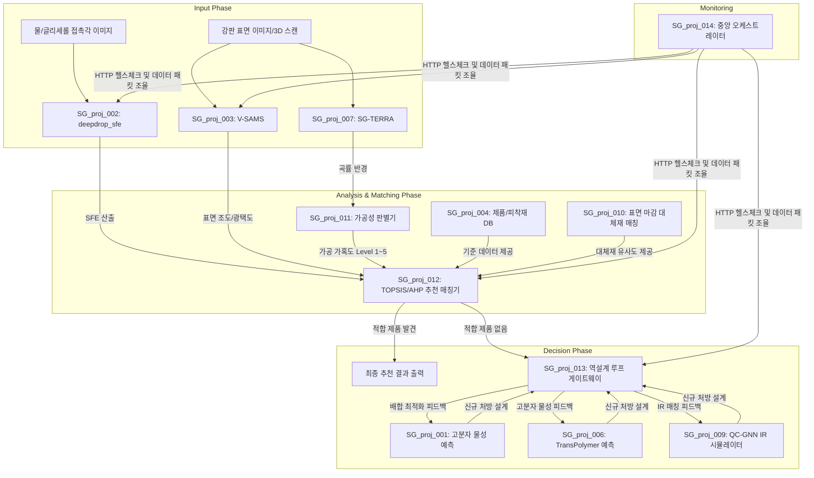

# AI 기반 점착제 파이프라인 E2E 아키텍처 및 흐름도 (v2.0)

본 보고서는 기존 `pipeline_verification_report.md` 작성 이후, 통합 프론트엔드(Step 1, 2, 3)의 서브모듈화 및 백엔드 오케스트레이터(`014`)의 SI 인계용 고도화 작업이 완료된 현재의 E2E 시스템 흐름을 명세합니다.

## 1. 아키텍처 발전 사항 (v2.0 업데이트)
- **프론트엔드 모듈 연동(Git Submodule)**: Step 1, 2, 3 대시보드 저장소에 코어 엔진 폴더를 하드카피하던 방식에서 벗어나, `SG_proj_001`~`013`을 각각 Git Submodule로 연결하여 독립성과 유지보수성을 극대화했습니다.
- **014 오케스트레이터의 SI 레디(SI-Ready) 방어 로직**: 프론트엔드-백엔드 데이터 배관 시 시스템 뻗음을 방지하기 위해 `Pydantic` 기반의 `Step1Metrics`, `Step2Target` 구조체를 도입했습니다. SFE, Tg, 3D 곡률 등에 대한 도메인 한계값을 설정하여 HTTP 422 에러로 튕겨내도록 예외 처리를 완료했습니다.

---

## 2. 플랫폼 데이터 및 제어 흐름 순서도 (Flowchart)

전체 14개 모듈이 데이터의 획득(Input), 연산/매칭(Analysis), 최종 의사결정(Decision) 단계에 걸쳐 어떻게 상호작용하는지 직관적으로 나타낸 데이터 흐름도입니다.

---

## 3. 모듈별 역할 세부 요약 (프론트/백엔드 관점)

### [Presentation Layer - Frontend Dashboards]
- **SG_integration_step1**: 계측 및 측정 데이터 입력 화면 (Input Phase 담당).
- **SG_integration_step2**: 데이터 연산 및 DB 조회 기반 매칭 결과 모니터링 화면 (Analysis & Matching Phase 담당).
- **SG_integration_step3**: 역설계된 분자 배합 및 물성 예측치 시각화 화면 (Decision Phase 담당).

### [Orchestration Layer - Backend Gateway]
- **SG_proj_014**: 위 프론트엔드들 사이에서 데이터 패킷이 오가는 통신망(Monitoring). 페이로드 스키마 검증, 예외 처리(에러 반환), 011~013 라우팅을 총괄.

### [Domain Core Layer - AI & DB Engines]
- **계측 엔진**: 002(SFE), 003(V-SAMS), 007(3D Curvature)
- **추천 및 DB**: 004(Central DB), 010(Alternative Matcher), 011(Processability), 012(MCDA Recommender)
- **AI 예측 엔진**: 001(XGBoost), 006(TransPolymer), 009(QC-GNN IR), 013(Reverse-Engineering Feedback)

---
*Document Version: 2.1 (Updated to Flowchart format)*
